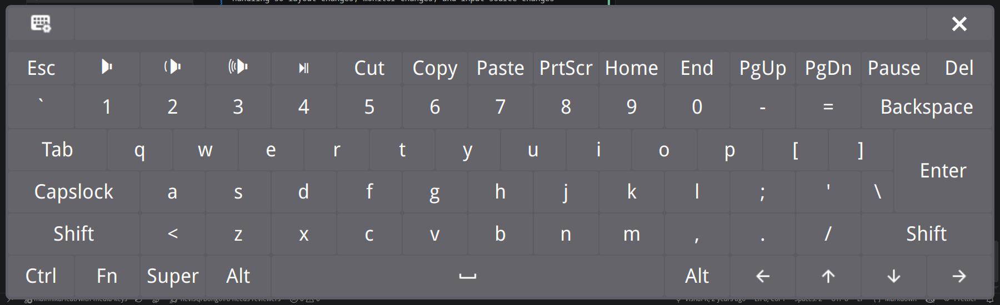

# GJS OSK fork
A (marginally) better on screen keyboard for GNOME

## Changes in This Fork (mainnika/feat/with-media-keys)
Upstream: https://github.com/Vishram1123/gjs-osk

Code quality note: this migration was done quickly with heavy, sometimes blind LLM assistance, so parts of the code may still be rougher than ideal. This fork is primarily something I maintain for my own use.

GNOME 50 migration highlights:

- **GNOME Shell 50 API compatibility**: Replaced the removed `edgeDragAction.js` import with the GNOME 50 `Shell.EdgeDragGesture` API and updated the extension metadata for GNOME Shell 50.
- **Upstream backports**: Backported relevant upstream changes developed separately during the GNOME 50 migration and adapted them to this fork.
- **Reliable packaging**: Added all runtime assets to the extension package, including `physicalLayouts.json`, `keycodes.tar.xz`, and UI assets, so manual pack/install works cleanly.
- **Input and touch fixes**: Reworked pointer, touch, drag, close-button, panel-icon, Super, Space, Caps Lock, and layout-switch handling for GNOME 50 event behavior.
- **Keyboard lifecycle stability**: Hardened refresh/open/close state handling so layout changes, monitor changes, and input-source changes rebuild the keyboard without disappearing or leaving stuck keys.
- **Layout and keycode safety**: Added safer layout loading, custom layout normalization, keycode fallback handling, and isolated per-key layout metadata to avoid leaking media mappings between layouts.
- **Modern GJS cleanup**: Replaced deprecated byte-array string conversion with `TextDecoder`, removed deleted Shell resources, and cleaned up timers/signals during destroy/disable.

This branch adds enhanced media key functionality to the on-screen keyboard:

- **Fast Typing Fix**: Improved key timeout handling with callback system
  - Previous timeout is now properly cleared before sending new keys
  - Callback function executes pending key releases before starting new operations
  - Prevents race conditions and key event conflicts when typing rapidly
  - Ensures reliable key press/release sequences even with fast input

- **FN Key Toggle**: New FN button that toggles between F keys and media keys
  - Media keys are shown by default
  - Press FN to switch to standard F1-F12 function keys
  - Visual indicator shows FN state (highlighted when active)

- **Custom Media Key Mappings**: F keys now have workflow-optimized media functions:
  - F1: Cut (✂️)
  - F2: Mute (🔇)
  - F3-F4: Volume Down/Up
  - F5: Play/Pause (⏯)
  - F6: Copy (📋)
  - F7: Paste (📄)
  - F8: Print Screen (auto-hides keyboard after press)
  - F9-F12: Navigation keys (Home, PgUp, PgDn, End)

- **JSON-Based Layout System**: Media key mappings are now defined in `physicalLayouts.json` for easy customization

- **Print Screen Auto-Hide**: Keyboard automatically closes when Print Screen is pressed to avoid appearing in screenshots
