# Keyboard Logic

```mermaid
flowchart TD
    Enable["Extension enable()"] --> LoadSettings["Load GSettings and metadata"]
    LoadSettings --> LoadLayouts["Read physicalLayouts.json"]
    LoadLayouts --> LoadCustomLayouts["Normalize custom-layout JSON"]
    LoadCustomLayouts --> RestoreFlag["Read indicator.keyboard-visible\ninto _restoreOpenAfterRefresh"]
    RestoreFlag --> ExtractKeycodes["Extract keycodes.tar.xz when needed"]
    ExtractKeycodes --> ResolveSource["Resolve current input source / XKB layout"]
    ResolveSource --> LoadKeymap["Load matching keycode JSON\nfallback: us.json"]
    LoadKeymap --> CreateKeyboard["Create Keyboard dialog"]

    CreateKeyboard --> InitState["Initialize modifiers, timers,\nlock-state handlers, and drag state"]
    InitState --> BuildUI["Build key rows from selected\nbuilt-in or custom layout"]
    BuildUI --> LayoutMeta["Apply layout metadata:\nsplit, settings button, close button"]
    LayoutMeta --> InitialClosed["setInitialClosedState()\nhidden without close animation"]
    InitialClosed --> AddEdgeGesture{"Edge swipe enabled?"}
    AddEdgeGesture -->|Yes| AttachEdge["Attach Shell.EdgeDragGesture"]
    AddEdgeGesture -->|No| SkipEdge["Skip edge gesture"]
    AttachEdge --> PatchShellOSK["Wrap Main.keyboard handlers"]
    SkipEdge --> PatchShellOSK
    PatchShellOSK --> AddPanel["Add panel indicator and quick setting"]

    AddPanel --> TriggerOpen{"Open trigger"}
    AttachEdge --> TriggerOpen

    TriggerOpen -->|Panel icon click / touch| ToggleKeyboard["Toggle keyboard"]
    TriggerOpen -->|Bottom edge gesture| OpenKeyboard["Open keyboard"]
    TriggerOpen -->|Shell OSK request| OpenKeyboard
    TriggerOpen -->|indicator.keyboard-visible true| OpenKeyboard

    ToggleKeyboard --> IsOpen{"State CLOSED/CLOSING?"}
    IsOpen -->|No| OpenKeyboard
    IsOpen -->|Yes| CloseKeyboard["Close keyboard"]

    OpenKeyboard --> PositionKeyboard["Pick monitor and position dialog"]
    PositionKeyboard --> ShowKeyboard["Show keyboard and set\nkeyboard-visible true"]

    ShowKeyboard --> Interaction{"User interaction"}
    Interaction -->|Mouse/touch key press| PressKey["Press virtual key"]
    Interaction -->|Mouse/touch key release| ReleaseKey["Release virtual key"]
    Interaction -->|Long press or enable-key-repeat| RepeatKey["Repeat key while held"]
    Interaction -->|Move handle drag| DragKeyboard["Move keyboard"]
    Interaction -->|Close button| CloseKeyboard
    Interaction -->|Settings button| OpenPrefs["Open extension preferences"]

    PressKey --> KeyType{"Key type"}
    KeyType -->|Character| EmitKeycode["Emit keycode through virtual device"]
    KeyType -->|Modifier| ToggleModifier["Toggle Shift/Ctrl/Alt/Super/Menu state"]
    KeyType -->|Caps/Num lock| SyncLockState["Sync lock state with keymap"]
    KeyType -->|Sound enabled| PlaySound["Play theme sound or sound-file"]

    EmitKeycode --> ReleaseKey
    ToggleModifier --> UpdateLabels["Update key labels and modifier style"]
    SyncLockState --> UpdateLabels
    RepeatKey --> EmitKeycode
    PlaySound --> EmitKeycode

    ReleaseKey --> ClearPressed["Clear pressed state / stop repeat"]
    ClearPressed --> Interaction
    DragKeyboard --> ClampPosition["Clamp to monitor bounds"]
    ClampPosition --> Interaction
    CloseKeyboard --> ReleaseMods["Release active virtual modifiers\nand clear repeat timers"]
    ReleaseMods --> HideKeyboard["Hide keyboard and set\nkeyboard-visible false"]

    LoadSettings --> WatchSettings["Watch settings changes"]
    WatchSettings --> SettingsChanged{"Relevant setting changed?"}
    SettingsChanged -->|Layout / monitor / size / style| CaptureOpen["Capture open state from actor\nor keyboard-visible"]
    SettingsChanged -->|Input source changed| RefreshKeyboard
    CaptureOpen --> RefreshKeyboard["Refresh keyboard safely"]
    RefreshKeyboard --> DestroyOld["Destroy old keyboard actor"]
    DestroyOld --> RestoreShellOSKForOld["Restore old Shell handler\nand edge gesture"]
    RestoreShellOSKForOld --> ResolveSource
    CreateKeyboard --> RestoreOpen{"_restoreOpenAfterRefresh?"}
    RestoreOpen -->|Yes| OpenKeyboard
    RestoreOpen -->|No| IdleClosed["Remain hidden"]

    Enable --> Disable["disable() later"]
    Disable --> DisconnectSignals["Disconnect signals and gestures"]
    DisconnectSignals --> RestoreShellOSK["Restore wrapped Shell handlers"]
    RestoreShellOSK --> DestroyActors["Destroy keyboard and panel indicator"]
```

## Refresh Behavior

Changing layout settings rebuilds the `Keyboard` actor. Before rebuild, the extension captures whether the keyboard is open using the actor state or `indicator.keyboard-visible`. The new actor is created hidden with `setInitialClosedState()`, then `_openKeyboard(true)` restores it if `_restoreOpenAfterRefresh` was set.

This avoids the previous failure mode where the constructor called animated `close()`, left the new actor in `CLOSING`, and caused the restore-open step to be skipped.
