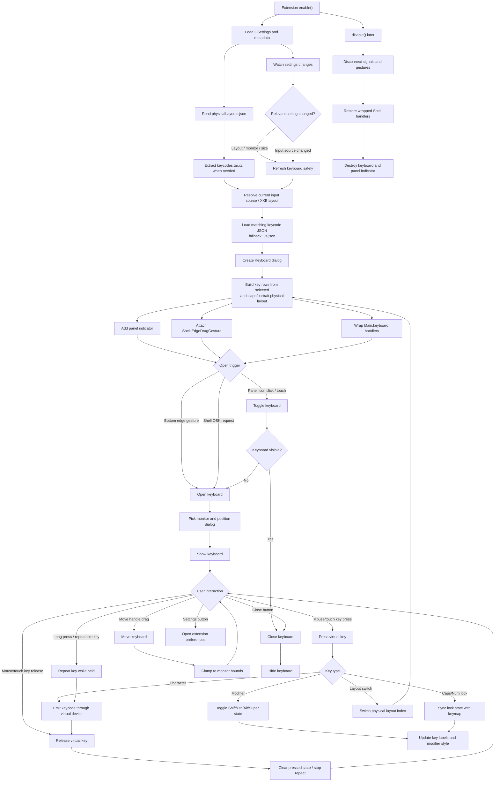

# Keyboard Logic

```mermaid
flowchart TD
    Enable["Extension enable()"] --> LoadSettings["Load GSettings and metadata"]
    LoadSettings --> LoadLayouts["Read physicalLayouts.json"]
    LoadLayouts --> ExtractKeycodes["Extract keycodes.tar.xz when needed"]
    ExtractKeycodes --> ResolveSource["Resolve current input source / XKB layout"]
    ResolveSource --> LoadKeymap["Load matching keycode JSON\nfallback: us.json"]
    LoadKeymap --> BuildKeyboard["Create Keyboard dialog"]

    BuildKeyboard --> BuildUI["Build key rows from selected\nlandscape/portrait physical layout"]
    BuildUI --> AddPanel["Add panel indicator"]
    BuildUI --> AddEdgeGesture["Attach Shell.EdgeDragGesture"]
    BuildUI --> PatchShellOSK["Wrap Main.keyboard handlers"]

    AddPanel --> TriggerOpen{"Open trigger"}
    AddEdgeGesture --> TriggerOpen
    PatchShellOSK --> TriggerOpen

    TriggerOpen -->|Panel icon click / touch| ToggleKeyboard["Toggle keyboard"]
    TriggerOpen -->|Bottom edge gesture| OpenKeyboard["Open keyboard"]
    TriggerOpen -->|Shell OSK request| OpenKeyboard

    ToggleKeyboard --> IsOpen{"Keyboard visible?"}
    IsOpen -->|No| OpenKeyboard
    IsOpen -->|Yes| CloseKeyboard["Close keyboard"]

    OpenKeyboard --> PositionKeyboard["Pick monitor and position dialog"]
    PositionKeyboard --> ShowKeyboard["Show keyboard"]

    ShowKeyboard --> Interaction{"User interaction"}
    Interaction -->|Mouse/touch key press| PressKey["Press virtual key"]
    Interaction -->|Mouse/touch key release| ReleaseKey["Release virtual key"]
    Interaction -->|Long press / repeatable key| RepeatKey["Repeat key while held"]
    Interaction -->|Move handle drag| DragKeyboard["Move keyboard"]
    Interaction -->|Close button| CloseKeyboard
    Interaction -->|Settings button| OpenPrefs["Open extension preferences"]

    PressKey --> KeyType{"Key type"}
    KeyType -->|Character| EmitKeycode["Emit keycode through virtual device"]
    KeyType -->|Modifier| ToggleModifier["Toggle Shift/Ctrl/Alt/Super state"]
    KeyType -->|Caps/Num lock| SyncLockState["Sync lock state with keymap"]
    KeyType -->|Layout switch| ChangeLayout["Switch physical layout index"]

    EmitKeycode --> ReleaseKey
    ToggleModifier --> UpdateLabels["Update key labels and modifier style"]
    SyncLockState --> UpdateLabels
    ChangeLayout --> BuildUI
    RepeatKey --> EmitKeycode

    ReleaseKey --> ClearPressed["Clear pressed state / stop repeat"]
    ClearPressed --> Interaction
    DragKeyboard --> ClampPosition["Clamp to monitor bounds"]
    ClampPosition --> Interaction
    CloseKeyboard --> HideKeyboard["Hide keyboard"]

    LoadSettings --> WatchSettings["Watch settings changes"]
    WatchSettings --> SettingsChanged{"Relevant setting changed?"}
    SettingsChanged -->|Layout / monitor / size| RefreshKeyboard["Refresh keyboard safely"]
    SettingsChanged -->|Input source changed| RefreshKeyboard
    RefreshKeyboard --> ResolveSource

    Enable --> Disable["disable() later"]
    Disable --> DisconnectSignals["Disconnect signals and gestures"]
    DisconnectSignals --> RestoreShellOSK["Restore wrapped Shell handlers"]
    RestoreShellOSK --> DestroyActors["Destroy keyboard and panel indicator"]
```
